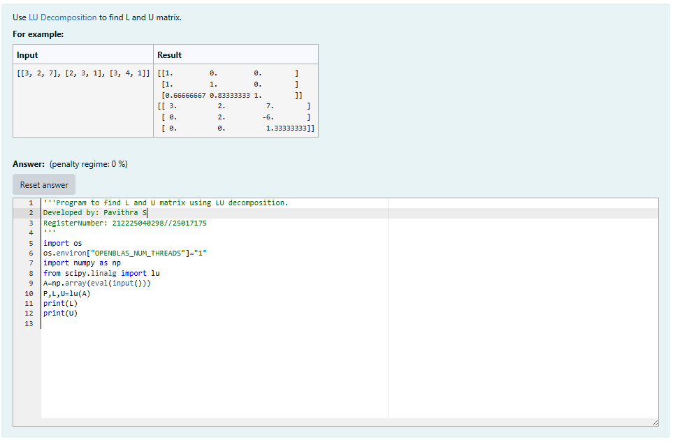
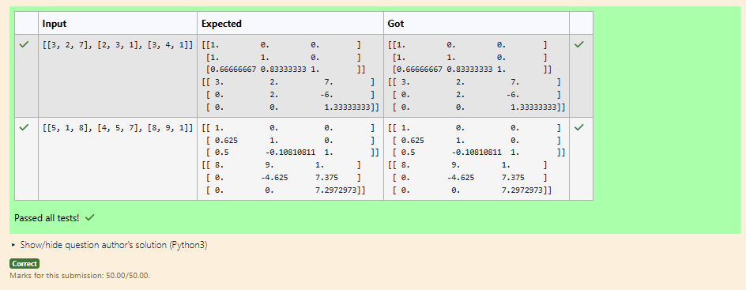
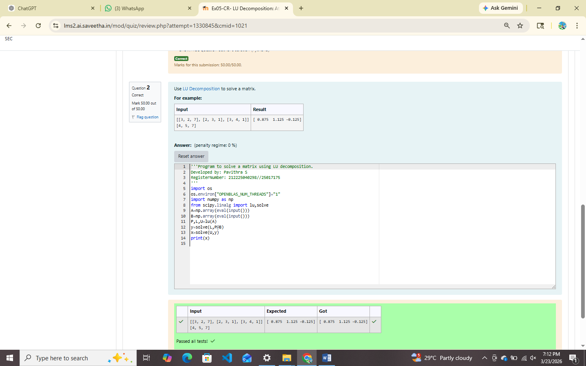

# LU Decomposition 

## AIM:
To write a program to find the LU Decomposition of a matrix.

## Equipments Required:
1. Hardware – PCs
2. Anaconda – Python 3.7 Installation / Moodle-Code Runner

## Algorithm
1. 
2. 
3. 
4. 

## Program:
(i) To find the L and U matrix
```
#Program to find L and U matrix using LU decomposition.
#Developed by: Pavithra S
#RegisterNumber: 212225040298//25017175

import os
os.environ["OPENBLAS_NUM_THREADS"]="1"
import numpy as np
from scipy.linalg import lu
A=np.array(eval(input()))
P,L,U=lu(A)
print(L)
print(U)

```
(ii) To find the LU Decomposition of a matrix
```
#Program to solve a matrix using LU decomposition.
#Developed by: Pavithra S
#RegisterNumber: 212225040298//25017175
import os
os.environ["OPENBLAS_NUM_THREADS"]="1"
import numpy as np
from scipy.linalg import lu,solve
A=np.array(eval(input()))
B=np.array(eval(input()))
P,L,U=lu(A)
y=solve(L,P@B)
x=solve(U,y)
print(x)

```

## Output:
(i)


(ii)



## Result:
Thus the program to find the LU Decomposition of a matrix is written and verified using python programming.

